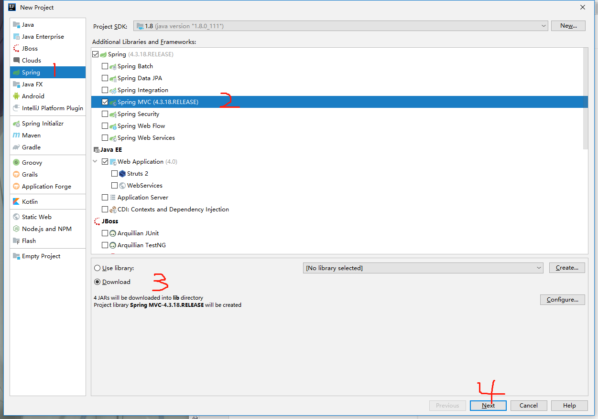
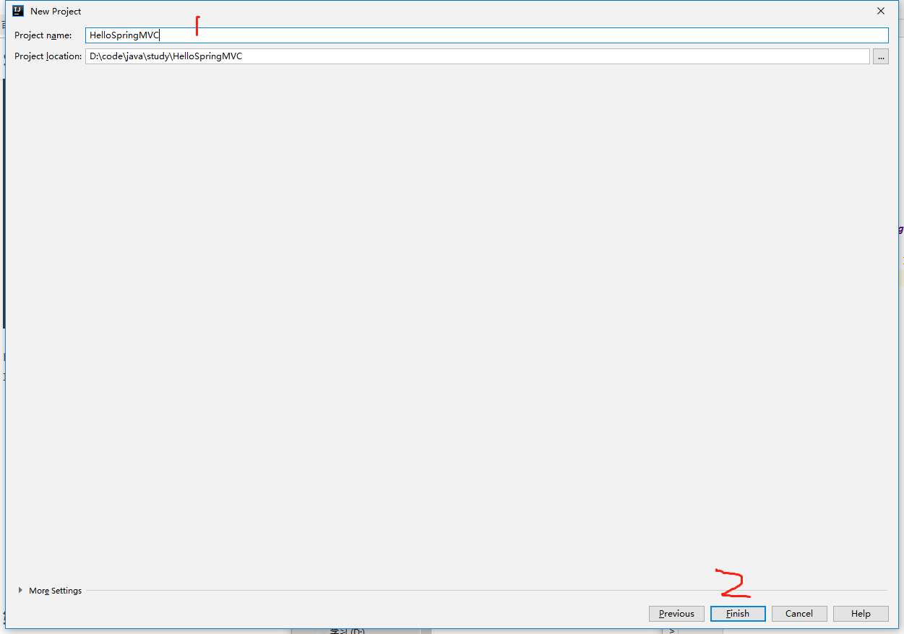

## 入门Spring MVC

 

 #### 写下我们的第一个Spring MVC程序
 环境：
 - IDE : idea 2019
 - jdk : 1.8
 - tomcat : v7.0.82

 ###### 1.在idea中创建Spring MVC项目

 - 打开idea2019，创建新项目，项目名为HelloSpringMVC
 

https://www.jianshu.com/p/91a2d0a1e45a